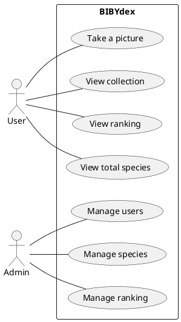

# Cahier des charges - Projet BIBYdex
## Introduction
Le projet BIBYdex vise à développer une application de type Pokedex qui permettra aux utilisateurs de collecter des photos d'animaux avec un aspect compétitif. L'application aura à la fois une version lourde (pour les appareils mobiles) et une version web pour assurer une expérience complète. L'objectif principal est de créer une expérience ludique pour les utilisateurs, tout en encourageant l'apprentissage et la découverte de nouvelles espèces animales.

## Fonctionnalités de l'application lourde
### L'application lourde sera principalement destinée aux appareils mobiles et comportera les fonctionnalités suivantes :

1. Prise de photo
Les utilisateurs pourront prendre des photos d'animaux à l'aide de la caméra de leur appareil. L'application devra permettre de prendre des photos nettes et de qualité suffisante pour permettre la reconnaissance de l'espèce.

2. Appel API pour la reconnaissance d'espèce
Une fois la photo prise, l'application devra utiliser une API de reconnaissance d'espèce pour identifier l'animal photographié. Les données sur l'espèce identifiée seront enregistrées dans la collection de l'utilisateur.

3. Visionnage de la collection
Les utilisateurs pourront visualiser leur collection d'animaux photographiés, accompagnée des informations sur chaque espèce. La collection devra être organisée de manière conviviale et intuitive.

4. Classement des joueurs
Un système de classement des joueurs sera mis en place pour encourager la compétition amicale entre les utilisateurs. Les classements seront basés sur diverses métriques, telles que le nombre d'espèces identifiées, le nombre de photos prises, etc.

## Fonctionnalités de l'application web
### L'application web complémentaire offrira des fonctionnalités spécifiques pour améliorer l'expérience de l'utilisateur :

1. Création de compte
Les utilisateurs devront créer un compte pour accéder à l'application web. Ils devront fournir des informations telles que leur nom, leur adresse e-mail et un mot de passe sécurisé.

2. Visionnage de la collection
Les utilisateurs pourront accéder à leur collection d'animaux photographiés depuis l'application web. Cette fonctionnalité sera synchronisée avec l'application lourde.

3. Classement des joueurs
Le classement des joueurs sera également disponible sur l'application web, offrant aux utilisateurs une vue d'ensemble de leur position par rapport aux autres participants.

4. Total des espèces
Les utilisateurs pourront consulter le nombre total d'espèces animales différentes qu'ils ont identifiées grâce à l'application.

5. Optionnel : Carte des espèces
Une fonctionnalité optionnelle consiste à intégrer une carte interactive affichant la distribution géographique des espèces animales identifiées par les utilisateurs. Cette fonctionnalité pourra être développée ultérieurement si les ressources le permettent.

## Contraintes techniques
L'application lourde devra être compatible sur android.
L'API de reconnaissance d'espèce devra être sélectionnée pour assurer des résultats de haute qualité.
Les données utilisateur, y compris les photos et les informations sur les espèces, devront être stockées de manière sécurisée et conforme aux réglementations de protection des données.

## Conclusion
Le projet BIBYdex vise à créer une expérience interactive et ludique pour les utilisateurs, en encourageant la découverte et la collecte d'informations sur les espèces animales. L'application lourde et l'application web travailleront de manière synergique pour offrir une expérience complète. Le respect des contraintes techniques et du calendrier de développement sera essentiel pour la réussite de ce projet passionnant.

## Diagrammes UML
### Diagramme de cas d'utilisation

